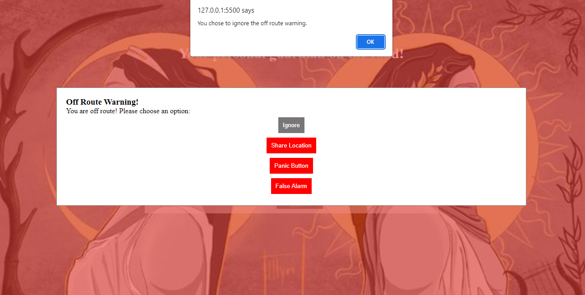

# _RouteGuard_
Your Personal Guardian on the Road!

RouteGuard is a powerful and intuitive web application that ensures your safety and peace of mind while traveling. By simply entering your source and destination, RouteGuard acts as your vigilant companion, providing real-time monitoring of your route. It utilizes the Google Maps API to track your location and compare it with the designated route. If you deviate from the planned path, RouteGuard instantly alerts you, keeping you aware and secure throughout your journey.

## Features
- Enter your source and destination to set up your route.
- Real-time monitoring of your location using the Geolocation API.
- Comparison of your current location with the designated route.
- Instant alerts and warnings if you deviate from the planned path.
- Options to ignore the warning, share your location, activate the panic button, or trigger a false alarm.
- Integration with Google Maps to visualize your route.
- User-friendly interface and easy-to-use controls.

## Technologies used 
- HTML
- CSS
- JavaScript
- Google Maps API
- Geolocation API
  
## Working
To get started with RouteGuard, simply enter your source and destination locations in the designated input fields. Once you have entered the information, RouteGuard will utilize the power of the Google Maps API to calculate the optimal route between the two points.
 

 

The map will then display the route, highlighting the path you should follow. This visual representation not only helps you navigate efficiently but also ensures that you stay on track throughout your journey. 
  
 

 
With RouteGuard, you can have confidence in your route and enjoy a hassle-free travel experience.
 

RouteGuard not only helps you plan and navigate your route but also ensures your safety by providing off-route warnings. If you deviate from the planned route for more than 5 minutes, RouteGuard will alert you, keeping you informed and helping you make necessary adjustments. With this feature, you can confidently stay on track and reach your destination without any unwanted detours. Stay safe and enjoy a worry-free journey with RouteGuard!
 

## Getting Started

To run the RouteGuard application locally, follow these steps:

1. Clone the repository: `git clone <repository_url>`
2. Open the `index.html` file in your web browser.
3. Enter your source and destination to set up your route.
4. Start monitoring your location by clicking the "Start" button.
5. If you deviate from the route, the off-route warning will be displayed.

## Contributing

We welcome contributions to enhance the functionality and user experience of RouteGuard. Here's how you can contribute:

1. Fork the repository.
2. Create a new branch: `git checkout -b feature/your-feature-name`.
3. Make your changes and commit them: `git commit -m 'Add some feature'`.
4. Push to the branch: `git push origin feature/your-feature-name`.
5. Submit a pull request.

